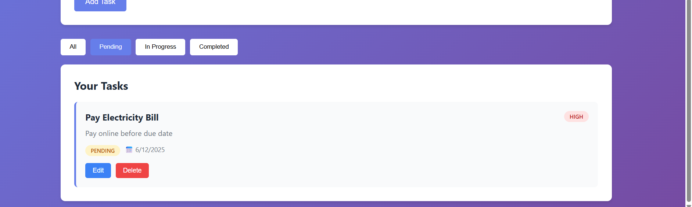

# 📋 Task Manager Application

A full-stack task management application built with FastAPI (Python) backend and Node.js (Express + EJS) frontend, using MySQL database.


## 🚀 Features

- ✅ Create, Read, Update, Delete (CRUD) tasks
- 📊 Dashboard with real-time statistics
- 🎯 Task prioritization (Low, Medium, High)
- 📅 Due date tracking
- 🔄 Status management (Pending, In Progress, Completed)
- 🔍 Filter tasks by status
- 💾 MySQL database for data persistence
- 🎨 Modern, responsive UI design

## 📸 Screenshots

### Dashboard


### Add Task


### Task List


### Edit Task


## 🛠️ Tech Stack

### Backend
- **Framework:** FastAPI (Python)
- **Database:** MySQL
- **ORM/Driver:** PyMySQL
- **Environment Management:** python-dotenv

### Frontend
- **Runtime:** Node.js
- **Framework:** Express.js
- **Template Engine:** EJS
- **HTTP Client:** Axios
- **Styling:** Custom CSS

## 📋 Prerequisites

Before running this project, make sure you have:

- Python 3.8 or higher
- Node.js 14 or higher
- MySQL Server 5.7 or higher
- Git (for cloning the repository)

## 🔧 Installation & Setup

### 1. Clone the Repository

```bash
git clone https://github.com/YOUR_USERNAME/task-manager.git
cd task-manager
```

### 2. Backend Setup

```bash
# Navigate to backend directory
cd backend

# Create virtual environment
python -m venv venv

# Activate virtual environment
# Windows:
venv\Scripts\activate
# Mac/Linux:
source venv/bin/activate

# Install dependencies
pip install -r requirements.txt

# Create .env file (copy from .env.example)
cp .env.example .env

# Edit .env file with your MySQL credentials
# DB_HOST=localhost
# DB_USER=root
# DB_PASSWORD=your_password
# DB_NAME=task_manager
```

### 3. Frontend Setup

```bash
# Open new terminal and navigate to frontend directory
cd frontend

# Install dependencies
npm install

# Create .env file (copy from .env.example)
cp .env.example .env

# Edit .env file if needed
# PORT=3000
# API_URL=http://localhost:8000
```

### 4. Database Setup

The application will automatically create the database and tables on first run. Just make sure MySQL server is running and your credentials in the backend `.env` file are correct.

## 🚀 Running the Application

### Start Backend Server

```bash
cd backend
# Make sure virtual environment is activated
uvicorn main:app --reload --port 8000
```

Backend will run on: `http://localhost:8000`

### Start Frontend Server

```bash
# Open new terminal
cd frontend
npm start
```

Frontend will run on: `http://localhost:3000`

### Access the Application

Open your browser and navigate to: `http://localhost:3000`

## 📁 Project Structure

```
task-manager/
├── backend/
│   ├── main.py              # FastAPI application
│   ├── requirements.txt     # Python dependencies
│   ├── .env.example         # Example environment variables
│   └── .env                 # Actual environment variables (not in git)
│
├── frontend/
│   ├── server.js            # Express server
│   ├── package.json         # Node.js dependencies
│   ├── .env.example         # Example environment variables
│   ├── .env                 # Actual environment variables (not in git)
│   ├── views/
│   │   └── index.ejs        # Main HTML template
│   └── public/
│       ├── css/
│       │   └── style.css    # Styling
│       └── js/
│           └── script.js    # Frontend JavaScript
│
├── screenshots/             # Application screenshots
├── .gitignore              # Git ignore file
└── README.md               # Project documentation
```

## 🔌 API Endpoints

### Tasks

- `GET /api/tasks` - Get all tasks
- `GET /api/tasks/{id}` - Get specific task
- `POST /api/tasks` - Create new task
- `PUT /api/tasks/{id}` - Update task
- `DELETE /api/tasks/{id}` - Delete task

### Statistics

- `GET /api/stats` - Get task statistics

## 🎨 Features in Detail

### Task Properties

- **Title:** Task name (required)
- **Description:** Detailed task description (optional)
- **Priority:** Low, Medium, or High
- **Status:** Pending, In Progress, or Completed
- **Due Date:** Task deadline (optional)
- **Created At:** Automatically set on creation
- **Updated At:** Automatically updated on modification

### Dashboard Statistics

- Total tasks count
- Pending tasks count
- In progress tasks count
- Completed tasks count

## 🐛 Troubleshooting

### Backend won't start

- Verify MySQL server is running
- Check database credentials in `.env`
- Ensure virtual environment is activated
- Verify all dependencies are installed

### Frontend won't connect to backend

- Make sure backend is running on port 8000
- Check `API_URL` in frontend `.env` file
- Verify CORS settings in backend

### Database connection errors

- Confirm MySQL credentials are correct
- Check if MySQL service is running
- Verify database user has proper permissions

## 🤝 Contributing

Contributions are welcome! Please feel free to submit a Pull Request.

## 📝 License

This project is open source and available under the [MIT License](LICENSE).

## 👨‍💻 Author

**Your Name**
- GitHub: [@Deeksha R H](https://github.com/DeekshaRH)


## 🙏 Acknowledgments

- FastAPI documentation
- Express.js community
- MySQL documentation

---

Made with ❤️ for PayAssured Internship Project
